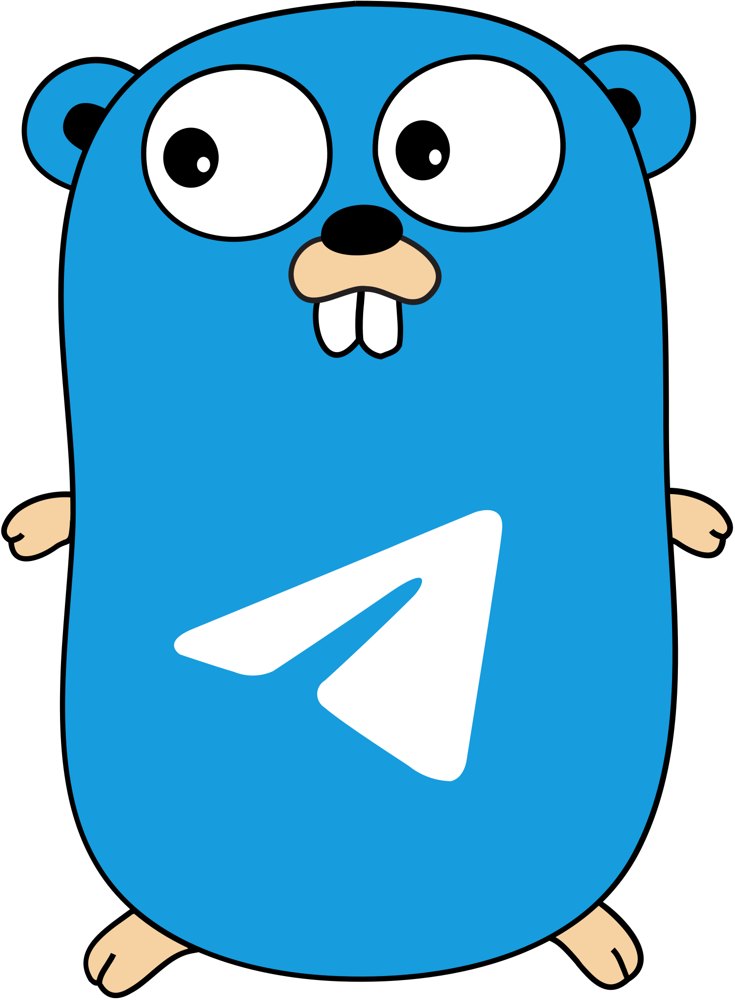

<p align="center">
    <a href="https://github.com/Squirrel-Network/GoBotApi">
        
    </a>
    <br><br>
    <b>AutoGenerated Telegram BotAPI Framework for GoLang</b>
    <br>
    <a href="https://github.com/pytgcalls/pytgcalls/tree/master/example">
        Examples
    </a>
    •
    <a href="https://github.com/pytgcalls/pytgcalls/tree/master/example">
        Documentation
    </a>
    •
    <a href="https://github.com/Squirrel-Network/gobotapi">
        Sources
    </a>
</p>

# GoBotAPI
[](https://go.dev/)
[](https://github.com/Squirrel-Network/gobotapi/blob/master/LICENSE)


**GoBotAPI** is a modern and elegant AutoGenerated [BotAPI](https://core.telegram.org/bots/api) Framework. This Framework provides a pure
Go implementation **without any external libs**

In addition to the official API, this Framework also provides some **high-level 
functions** that make it easier to use the API.

> The Telegram API scheme depends on your build, but if you don't want to compile by your self you
can use the package compiled from [pkg.go.dev/Squirrel-Network/gobotapi](https://pkg.go.dev/Squirrel-Network/gobotapi).

## How to install?
Here's how to add the GoBotApi Framework to your project, the command are given below:
``` bash
go get -u github.com/Squirrel-Network/gobotapi
```

<hr>
<p align="center">
    <a href="https://github.com/Squirrel-Network/GoBotApi">
        
    </a>
    <br><br>
    <br>
    <a href="https://github.com/Squirrel-Network/GoBotApi/releases">
        Releases
    </a>
    •
    <a href="https://github.com/Squirrel-Network/gobotapi">
        Sources
    </a>
</p>

# GoBotAPI Generator
[](https://go.dev/)
[](https://github.com/Squirrel-Network/GoBotApiCompiler/blob/master/LICENSE)


**GoBotAPI Generator** is the generator for the GoBotAPI Framework. It generates a new BotAPI Framework from the given
[BotAPI](https://core.telegram.org/bots/api) schema.

## Credits
Big thanks to [@Laky-64] for making this project possible, special thanks [@geiccobs] for his own package as 
starting point for this project, also thanks to [@empijei] for help about the project design and to
[@LucaTheHacker] for optimizations.

[@Laky-64]: https://github.com/Laky-64
[@geiccobs]: https://github.com/geiccobs
[@empijei]: https://github.com/empijei
[@LucaTheHacker]: https://github.com/LucaTheHacker
